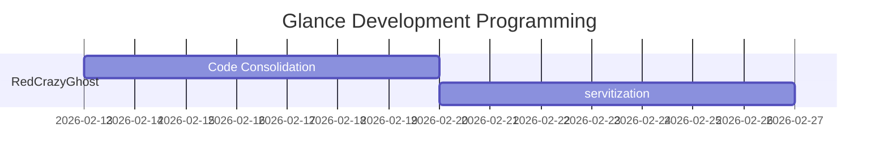

# Glance(瞥一眼)



## Use Glance

### Quick use Glance(推荐/recommend)

1. Download Glance application
> file are built from source code

2. Run Glance application file

### build application

1. Use git clone Glance project
```shell
git clone https://github.com/RedCrazyGhost/Glance.git
```
2. Use Shell code build source code
> In the glance directory
```shell
go build
```
3. Run the packaged execution file


## What is Glance?
Glance is 一个自动化梳理财产流水的application


## Why Glance？

Glance does the following for you:

- 自动梳理